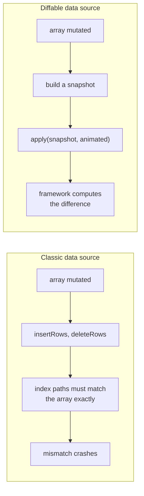
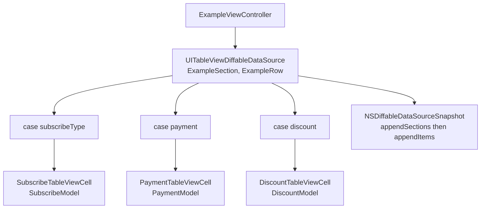

# Diffable Data Source

*The classic table view data source and the diffable one, side by side in one project.*

    

## Overview

Three screens. The first uses `UITableViewDataSource` the traditional way. The second uses
`UITableViewDiffableDataSource` with a simple string item so the snapshot mechanism is visible. The
third is the interesting one: a subscription screen where sections and rows are enums with associated
values, so a single table renders three unrelated cell types safely.

## What changes between the two



## The heterogeneous screen



`ExampleRow` is a `Hashable` enum whose cases each carry their own model. The cell provider switches
on the case and returns the matching cell, so the compiler guarantees that every row type is handled.

## Implementation notes

- **Hashable is the contract.** Both the section and the item type must be `Hashable`, because the
  framework identifies rows by hash rather than by index. Getting this wrong is the usual cause of
  rows that refuse to animate.
- **Snapshots are values.** A snapshot is built, populated and applied. Nothing is mutated in place,
  which is what removes the class of crashes the classic API is known for.
- **Associated values instead of a common protocol.** Carrying the model inside the enum case avoids
  casting in the cell provider.
- **The comparison is the point.** Keeping the old approach in the same project makes the difference
  concrete rather than theoretical.

## Project structure

```
DiffableDataSource/
├── ViewController.swift          classic UITableViewDataSource
├── DiffableDataSource/
│   ├── SecondViewController.swift    diffable with a plain String item
│   └── TableViewModels.swift         Section enum, Row struct
└── Example/
    ├── ExampleViewController.swift   diffable with heterogeneous rows
    ├── ExampleModels.swift           ExampleSection, ExampleRow and their models
    └── Cells/                        Subscribe, Payment, Discount cells
```

## Requirements

Xcode 15 or later, iOS 17.5 or later. No external dependencies.
